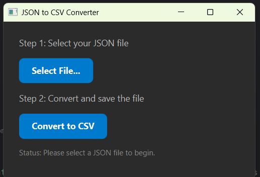

#  Java JSON to CSV Converter Pro 

Eduardo Antonio Gutierrez Carreon           UUID: 3331

A user-friendly desktop application built with Java & JavaFX to effortlessly convert complex JSON files into a structured CSV format. This project was developed to fulfill the requirements of the Digital NAO "Back End in Java" challenge.

---

### ✨ Demo in Action

---

### 📌 The Challenge (Problem Context)
In many professional environments, data is often generated or received in flexible JSON format. However, for analysis, reporting, and integration with spreadsheet software (like Excel) or legacy systems, a simple, tabular CSV format is required. The manual process of converting this data is slow, tedious, and highly prone to human error, creating significant bottlenecks in data workflows.

### 🎯 The Solution (Project Objective)
This application provides an intuitive graphical user interface (GUI) that automates the entire conversion process. It was designed to be a robust and user-friendly tool that bridges the gap between hierarchical JSON data and tabular CSV structures. With just a few clicks, any user can select a JSON file and instantly generate a clean, well-structured CSV file, saved directly to their Downloads folder.

---

### 🛠️ Technologies Used (Tech Stack)

| Component | Technology | Purpose |
| :--- | :--- | :--- |
| **Core Logic** | Java 17 | The main programming language for the application's functionality. |
| **User Interface** | JavaFX | Used to create a modern, responsive, and styled desktop GUI. |
| **JSON Parsing** | Google Gson | A powerful and efficient library for reliably converting JSON into Java objects. |
| **CSV Writing** | OpenCSV | A standard and flexible library for creating and writing well-formatted CSV files. |
| **Dependencies** | Maven | Manages the project's external libraries and automates the build process. |
| **Version Control**| GitHub | Used for source code management, versioning, and project history. |
| **Documentation**| JavaDoc | The standard for creating API documentation directly from the source code. |

---

### 🏗️ Project Architecture & Key Components

The project is structured to ensure a clear separation of concerns, enhancing maintainability and scalability.

* **`pom.xml`**: The core Maven configuration file. It defines project information and manages all dependencies (Gson, OpenCSV, JavaFX).
* **`src/main/resources/styles.css`**: An external CSS file used to give the graphical interface a modern, dark-theme look and feel.
* **`JsonReader.java`**: This class contains the logic for file handling. It opens a user-selected `.json` file and uses Gson to parse its contents, handling potential errors like a missing file or syntax issues.
* **`CsvWriter.java`**: This class receives the data parsed by the `JsonReader`. It contains the core data transformation logic and uses OpenCSV to write the data into a formatted `.csv` file.
* **`MainGui.java`**: This is the main entry point of the application. It builds and displays the GUI using JavaFX and orchestrates the user workflow, calling the reader and writer classes in response to button clicks.

---

### 🧠 Transformation Algorithm

The data conversion process follows a structured algorithm to ensure accurate mapping from the JSON structure to a flat CSV format.

**Pseudocode:**
1.  **START** Application.
2.  **WAIT** for user to click "Select File...".
3.  **OPEN** a file chooser dialog.
4.  **USER SELECTS** an `input.json` file.
5.  **STORE** the file path.
6.  **WAIT** for user to click "Convert to CSV".
7.  **VALIDATE** that a file has been selected. If not, show error in UI and **STOP**.
8.  **READ & PARSE** the selected JSON file using the `JsonReader` class.
9.  **IF** file not found or format is invalid, show error in UI and **STOP**.
10. **EXTRACT** the primary data list (e.g., "publications" or "prestamos") from the parsed data.
11. **WRITE** the data to a new CSV file in the "Downloads" folder using the `CsvWriter` class.
12. **IF** a write error occurs, show error in UI and **STOP**.
13. **DISPLAY** success message in the UI.
14. **END**

---

### 📋 Strategic Design Decisions

| Decision | Rationale |
| :--- | :--- |
| **GUI (JavaFX) vs. CLI** | A GUI was chosen to provide an intuitive and accessible experience for non-technical users, reducing errors and making the tool more versatile in a business/academic setting. |
| **External CSS Styling** | Separating the UI's styling into a `.css` file follows modern best practices. It decouples the application's logic from its presentation, making the code cleaner and easier to maintain or re-skin in the future. |
| **Maven for Dependencies**| Maven automates the process of managing external libraries. This ensures a reliable, reproducible build process and makes it easy to update dependencies, which is critical for long-term project sustainability. |
| **Gson for JSON Parsing**| Gson was selected for its simplicity, excellent performance, and robust handling of converting JSON into Java objects, which simplified the data mapping logic. |

---

### 🧪 Testing Strategy & Error Handling

The project's quality was ensured through a manual testing strategy focused on user workflow and robustness.

* **Functional "Happy Path" Test:** Verified that a valid JSON file is correctly converted into a CSV file with the expected content and headers.
* **Error Handling Test 1 (File Not Found):** Verified that if the "Convert" button is clicked before a file is selected, the GUI displays a clear error message to the user without crashing.
* **Error Handling Test 2 (Malformed JSON):** Verified that if a syntactically incorrect JSON file is selected, the application handles the parsing exception gracefully and reports the error in the status label.

---

### 🚀 How to Run

1.  **Clone the repository:** `git clone [URL_of_your_repository]`
2.  **Open in IDE:** Import the project as a "Maven Project" in IntelliJ IDEA. The IDE will automatically download all dependencies.
3.  **Configure VM Options:** Before running, the JavaFX runtime requires VM options. Go to **Edit Configurations... > Modify options > Add VM options** and add the required `--module-path` and `--add-modules` arguments pointing to your local JavaFX SDK path.
4.  **Run:** Locate and run the `MainGui.java` class to launch the application.

---

### 📚 Additional Documentation

* **Project Backlog & Planning:** [Link to your Backlog PDF]
* **Visual Project Roadmap:** [Link to your Miro Roadmap]